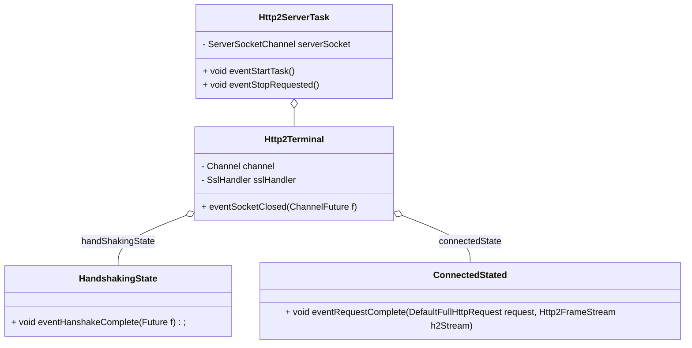
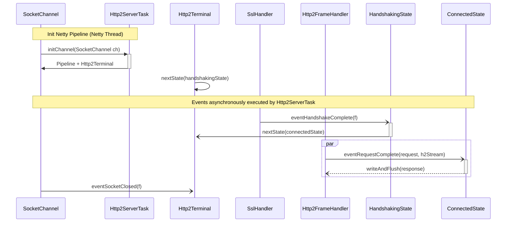

# MiA Custom Http/2 server

This example shows you how to design a custom Netty-based http/2 server (also compatible with Http/1.1).

## Design

This sample uses MiA 3 stages design. In the following class diagram, you can see how the events are spread across the different levels.



## Event sequences


## How to run ?

```bash
# Run the server
mvn compile exec:java

# Send a request with curl
curl --insecure https://localhost:8443/HelloWorld
```